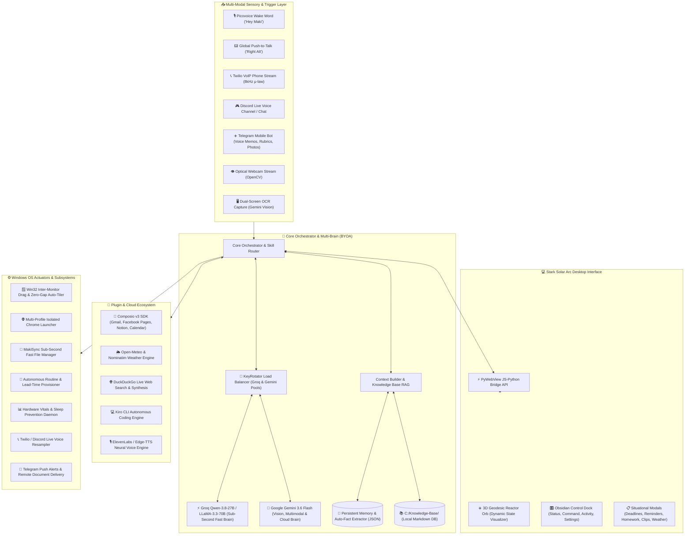

<div align="center">

# 🤖 MAKI·AI (巻)
### *Next-Generation Autonomous Desktop Companion & Windows OS Orchestrator*

<p align="center">
  <a href="https://git.io/typing-svg">
    
  </a>
</p>

<p align="center">
  
  
  
  
  
  
  
  
  
</p>

---

</div>

## 📖 Overview

**MakiAI** is an autonomous desktop companion and Windows operating system orchestrator built with a **Cybernetic Stark Solar Arc** design aesthetic. Engineered for high-performance productivity, academic automation, client workflow management, and 24/7 remote accessibility, MakiAI combines local hardware-level OS control with a dual-brain neural reasoning engine and interactive holographic workflows.

Whether triggered via local wake words, hardware Push-to-Talk, live telephone calls, Discord voice channels, or Telegram mobile bots, MakiAI acts as an omniscient digital copilot that manages your multi-monitor workspaces, monitors hardware health, drafts academic assignments, synchronizes inboxes, and automates your entire daily schedule.

---

## 🌟 What's New in MakiAI

### 🔑 1. Enterprise Multi-Key Auto-Rotation Pool (`KeyRotator`)
- **Multi-Key Ring Buffer:** Load 1 to 10+ API keys for Groq (`GROQ_API_KEYS`) and Gemini (`GEMINI_API_KEYS`) in `.env` for infinite compute.
- **Live Quota Header Tracking:** Intercepts `x-ratelimit-remaining-tokens` on every turn.
- **Proactive Low-Quota Auto-Switch:** If a key's remaining token capacity drops below **15%**, MakiAI proactively swaps to the next fresh key *before* hitting any 429 blocks.
- **Reactive <50ms Failover:** If a per-minute burst rate limit occurs, MakiAI retries immediately on the next healthy key with zero user interruption.
- **Timed Cooldown Loops:** Automatically applies a 60-second cooldown for burst limits and loops keys back into active rotation once recovered.
- **Startup Quota Health Dashboard:** Probes all configured keys in parallel on boot and displays an active/standby status dashboard.

### 📞 2. Twilio Live Phone Calling & Mobile Web VoIP
- **Live Telephone Conversations:** Call MakiAI from your mobile phone number via Twilio Voice Webhooks and bidirectional Media Streams.
- **Bi-Directional Audio Resampling:** Real-time G.711 µ-law 8kHz <-> 16kHz linear PCM streaming over WebSockets with voice activity detection (VAD).
- **Mobile Web Phone App:** Call MakiAI directly from your local browser (`http://localhost:5050/call`).

### 🌦️ 3. Live Weather & Environmental Forecast Engine (`WeatherSkill`)
- **Zero-API-Key Precision Weather:** Real-time atmospheric telemetry powered by Open-Meteo and Nominatim geocoding.
- **Configurable Location:** Automatically geolocates or uses your saved home city (`USER_LOCATION="Digos City, Davao del Sur"`).
- **Sub-Millisecond Morning Briefing:** Instant voice briefings synced with on-screen holographic daily timeline modals.

### 🛡️ 4. Whisper Hallucination Shield
- Filters out phantom background noise artifacts (`"Thank you."`, `"Thank you for watching."`, `"Subtitles by..."`, single characters) when ambient silence is recorded.

---

## 🔑 Bring Your Own Architecture (BYOA)

MakiAI is built with a **100% BYOA (Bring Your Own API / Architecture)** philosophy:
- **Zero Vendor Lock-In:** Supply your own API keys for Groq, Google Gemini, ElevenLabs, Composio, Twilio, Picovoice, Discord, and Telegram.
- **Dynamic Multi-Tier Fallback:** If Groq hits a daily token quota, MakiAI automatically fails over to Gemini 3.6 Flash without dropping conversation turns.
- **Audio Fallback Hierarchy:** ElevenLabs voice synthesis gracefully falls back to free Microsoft Edge Neural TTS (`en-GB-RyanNeural`) or native SAPI5 if credits expire.
- **Local-First Knowledge & Memory:** Personal files, memories, and schedules reside locally on your filesystem (`C:\Knowledge-Base` and `C:\MakiSync Storage`).

---

## 🌌 System Architecture & Data Flow



---

## ⚡ Core Features & Capabilities

### 🧠 1. Central Orchestration & Dynamic Dual-Brain
- **Sub-Second Intent Routing:** Routes commands through regex pattern matchers, domain-specific skill modules, or generative LLMs in under 50ms.
- **Automatic Multi-Key Failover:** Seamlessly balances load across multiple Groq and Gemini API keys with live quota monitoring.
- **Bilingual Tagalog & English Comprehension:** Full native support for conversational Tagalog (`"Ano schedule ko today?"`, `"Tandaan mo paborito kong IDE..."`) and English.

### 🪟 2. Win32 Desktop Control & Multi-Monitor Window Management
- **Inter-Monitor Window Dragging:** Visually transfers active application windows between Monitor 1 and Monitor 2 with smooth animations.
- **Zero-Gap Auto-Tiler:** Organizes open applications into customizable grid layouts (50/50 split, 3-column, or 2x2 quadrants).
- **Process & Lifecycle Control:** Launches, brings to foreground, minimizes, maximizes, and terminates desktop software (VS Code, Spotify, browsers, File Explorer).

### 👁️ 3. Dual-Vision Engine (Webcam Observer & Screen OCR)
- **Optical Webcam Vision:** Captures real-time frames from your webcam to identify held objects, recognize environments, and save captures to `C:\MakiSync Storage\MakiAI\Photos`.
- **Contextual Screen Debugging:** Takes instantaneous multi-monitor screenshots for OCR, terminal stack trace analysis, coding error debugging, and UI verification.

### 📞 4. 24/7 Remote Bridges (Phone Calls, Discord, Telegram)
- **Twilio Live Phone Calling:** Full-duplex voice phone calls from your personal cell phone number to MakiAI.
- **Discord Voice VoIP Channel:** Joins your Discord voice channel (`!call`), listens to conversational audio, and speaks responses directly into the call.
- **Telegram Mobile Copilot:** Send voice notes (transcribed via Groq Whisper), upload assignment rubric photos for automated document generation, or trigger remote PC screenshots (`/screenshot`).

### 🚀 5. Autonomous Routine Engine & Lead-Time Provisioning
- **Schedule-Aware Daemon:** Continuously monitors your daily agenda and provisions workspaces 15 minutes before scheduled calendar events.
- **College Class Workspaces (`BAT-600` / `ICC-600`):** Boots Google Meet, Google Classroom, and relevant project directories.
- **Client Marketing & Job Hunting Workspaces:** Automatically organizes multi-profile browser windows for freelance and job applications.

---

## 🔌 Integrated Plugins & Ecosystem

| Plugin / Service | Purpose & Capability | BYOA Config Key |
|---|---|---|
| **KeyRotator Pool** | Multi-key load balancer and rate-limit shield for Groq and Gemini with live quota header tracking. | `GROQ_API_KEYS`, `GEMINI_API_KEYS` |
| **Twilio Voice Bridge** | Live telephone calling over WebSockets and G.711 µ-law Media Streams. | `TWILIO_ACCOUNT_SID`, `TWILIO_AUTH_TOKEN` |
| **Open-Meteo Weather** | Zero-API-key atmospheric telemetry, rainfall prediction, and geocoding. | `USER_LOCATION` |
| **Composio v3 SDK** | Connects MakiAI to 100+ cloud tools: reads & drafts Gmail emails, interacts with Facebook Pages, syncs Notion pages, manages Google Calendar, Slack, and GitHub. | `COMPOSIO_API_KEY` |
| **Groq Cloud** | High-throughput ultra-low latency inference for Qwen 27B, LLaMA 70B, and Groq Whisper (`whisper-large-v3-turbo`). | `GROQ_API_KEY` / `GROQ_API_KEYS` |
| **Google Gemini API** | Multimodal reasoning, visual webcam feed inspection, screen OCR debugging, and fallback intelligence (`gemini-3.6-flash`). | `GEMINI_API_KEY` / `GEMINI_API_KEYS` |
| **ElevenLabs** | Ultra-realistic, emotional AI voice cloning and neural speech generation. | `ELEVENLABS_API_KEY` |
| **Microsoft Edge TTS** | Free, reliable, low-latency neural voice synthesis (`en-GB-RyanNeural`, `en-US-GuyNeural`). | Included by default |
| **Picovoice Porcupine** | Offline, zero-latency wake-word engine running locally on Windows for "Hey Maki" detection. | `PORCUPINE_ACCESS_KEY` |
| **Kiro CLI** | Autonomous terminal-based coding assistant integration for generating scripts and refactoring repositories. | Local CLI Auth |
| **DuckDuckGo Search** | Live web search synthesis fallback for news, documentation, and research topics. | Free / Built-in |

---

## 🛠️ Step-by-Step Installation & Setup

### 1. Prerequisites
- **Operating System:** Windows 10 or Windows 11 (64-bit)
- **Python:** Version `3.11` (Recommended)
- **FFmpeg:** Installed and added to your Windows `PATH` (Required for VoIP streaming and audio processing)
- **Hardware:** Microphone and optical webcam

### 2. Clone the Repository
```powershell
git clone https://github.com/makinity/MakiAI.git
cd MakiAI
```

### 3. Create & Activate Virtual Environment
```powershell
py -3.11 -m venv venv
.\venv\Scripts\activate
```

### 4. Install Dependencies
```powershell
pip install -r requirements.txt
pip install "discord.py[voice]"
```

### 5. Configure Your Environment Variables (`.env`)
Create a `.env` file in the root directory (or use `.env.example` as a template):

```ini
# ==============================================================================
# 🧠 MULTI-KEY AI REASONING ENGINES (BYOA)
# ==============================================================================
# Groq Multi-Key Pool (Comma-separated for auto-switching & infinite quota)
# Free keys: https://console.groq.com/keys
GROQ_API_KEYS="gsk_key1_here, gsk_key2_here, gsk_key3_here"
GROQ_MODEL=qwen/qwen3.8-27b

# Google Gemini Multi-Key Pool (Vision, reasoning, and fallback)
# Free keys: https://aistudio.google.com/app/apikey
GEMINI_API_KEYS="AIzaSy_key1_here, AIzaSy_key2_here"
GEMINI_MODEL=gemini-3.6-flash

# ==============================================================================
# 🎙️ AUDIO, WAKE WORD & SPEECH (BYOA)
# ==============================================================================
PORCUPINE_ACCESS_KEY=your_picovoice_access_key_here
WAKE_WORD=Hey Maki
PTT_KEY=right alt

# Voice Synthesis (ElevenLabs or Free Edge-TTS)
ELEVENLABS_API_KEY=your_elevenlabs_key_here
ELEVENLABS_VOICE_ID=your_voice_id_here
TTS_VOICE=en-GB-RyanNeural

# Optional Audio Ducking (defaults to false to keep PC volume untouched)
AUDIO_DUCKING=false

# ==============================================================================
# 📞 24/7 REMOTE BRIDGES (BYOA)
# ==============================================================================
# Twilio Live Phone Calling Bridge
TWILIO_ENABLED=false
TWILIO_ACCOUNT_SID=your_twilio_account_sid_here
TWILIO_AUTH_TOKEN=your_twilio_auth_token_here
TWILIO_PHONE_NUMBER=your_twilio_virtual_number_here
TWILIO_AUTHORIZED_CALLER=your_personal_phone_number_here

# Telegram Mobile Bot
TELEGRAM_BOT_TOKEN=your_telegram_bot_token_here
TELEGRAM_ALLOWED_USER_ID=your_numeric_telegram_user_id

# Discord VoIP Bot
DISCORD_BOT_TOKEN=your_discord_bot_token_here
DISCORD_GUILD_ID=your_discord_server_id
DISCORD_VOICE_CHANNEL_ID=your_voice_channel_id
DISCORD_TEXT_CHANNEL_ID=your_text_channel_id

# ==============================================================================
# 📂 LOCAL STORAGE & LOCATION
# ==============================================================================
KB_PATH=C:\Knowledge-Base
MAKI_SYNC_PATH=C:\MakiSync Storage
USER_LOCATION=Digos City, Davao del Sur
USER_NAME=Maki
APP_NAME=MakiAI
```

### 6. Launch MakiAI
```powershell
python main.py
```

---

## 🎯 How to Use MakiAI

### 🎙️ 1. Local Voice & Push-to-Talk
- **Hands-Free Wake Word:** Say **"Hey Maki"** followed by your command or question.
- **Global Push-to-Talk (PTT):** Hold `Right Alt` while speaking from anywhere in Windows.
- **Schedule & Morning Briefing:** Ask *"What is my schedule today?"* for an instant holographic schedule digest.

### 📞 2. Live Phone Calling
- Call MakiAI directly from your cell phone over telephone lines via your Twilio number, or open `http://localhost:5050/call` on your phone browser.

### 🪟 3. Window & Workspace Tiling
- *"Move Chrome to my second monitor"*
- *"Organize my workspace"* / *"Tile my windows side by side"*

### 👁️ 4. Physical & Digital Vision Inquiries
- *"What am I holding right now?"*
- *"Look at my screen and tell me why this code failed"*

---

## 📄 License & Copyright

This project is licensed under the **MIT License**. See the [LICENSE](LICENSE) file for complete terms and copyright details.

```text
MIT License
Copyright (c) 2026 Maki Liones (makinity)
```

---

<div align="center">
  <sub>Developed with ❤️ by <b>Mark Vencent Juntilla (makinity)</b> · Autonomous Systems & Desktop AI Architecture</sub>
</div>
