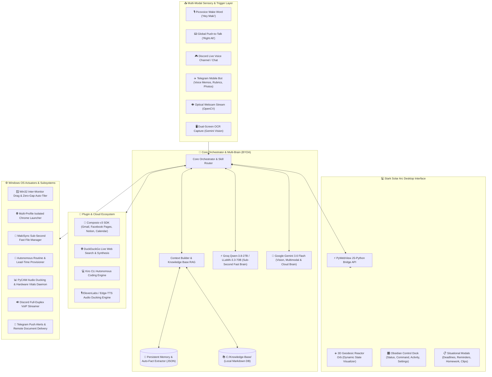

<div align="center">

# 🤖 MAKI·AI (巻)
### *Next-Generation Autonomous Desktop Companion & Windows OS Orchestrator*

<p align="center">
  <a href="https://git.io/typing-svg">
    
  </a>
</p>

<p align="center">
  
  
  
  
  
  
  
  
  
</p>

---

</div>

## 📖 Overview

**MakiAI** is an autonomous desktop companion and Windows operating system orchestrator built with a **Cybernetic Stark Solar Arc** design aesthetic. Engineered for high-performance productivity, academic automation, client workflow management, and 24/7 remote accessibility, MakiAI combines local hardware-level OS control with a dual-brain neural reasoning engine and interactive holographic workflows.

Whether triggered via local wake words, hardware Push-to-Talk, Discord voice channels, or Telegram mobile bots, MakiAI acts as an omniscient digital copilot that manages your multi-monitor workspaces, monitors hardware health, drafts academic assignments, synchronizes inboxes, and automates your entire daily schedule.

---

## 🌟 What's New: Stark Solar Arc 3D Reactor & Holographic UI

MakiAI features a modern **HTML5/WebGL/Canvas Desktop UI** powered by PyWebView, styled with an obsidian glassmorphism aesthetic and dynamic amber/gold accents (`#FF9D00`, `#FF6A00`, `#060402`):

- **3D Geodesic Icosahedron Reactor Orb**: A real-time 3D rendered polyhedral sphere with depth-sorted vertices, glowing laser spires, and orbital accretion embers.
- **Audio-Reactive State Indicators**:
  - 🗣️ **Speaking Mode**: Harmonic vocal resonance pulses, outward-expanding acoustic soundwave ripples, and luminous solar flare needles.
  - 🎙️ **Listening Mode**: Accretion vortex where ambient energy particles flow inward toward the core singularity, signifying voice ingestion.
  - 🧠 **Thinking Mode**: High-speed counter-rotating gyroscope axes with quantum synaptic sparks traversing along wireframe edges.
  - 🔍 **Searching / Tools Mode**: 360° holographic radar sweep beam and periodic sonar radar scan waves.
  - 🌌 **Idle Mode**: Hypnotic 3.5-second cosmic respiration cycle with gentle Saturnian dust ring precession.
- **Situational Glass Modals**: Dedicated interactive workflows for Deadlines, Voice Reminders, Academic Homework (.docx), Video Clipping, Project Scaffolding, and Morning Mission Briefings.
- **In-App Live Settings Panel**: Hot-apply API keys, ElevenLabs voice IDs, wake word triggers, and storage roots on the fly without restarting.

---

## 🔑 Bring Your Own Architecture (BYOA)

MakiAI is built with a **100% BYOA (Bring Your Own API / Architecture)** philosophy. You retain complete ownership and control over your keys, quotas, models, and personal data:

- **Zero Vendor Lock-In:** Supply your own API keys for Groq, Google Gemini, ElevenLabs, Composio, Picovoice, Discord, and Telegram in a local `.env` file or via the in-app Settings panel.
- **Dynamic Multi-Tier Fallback:** If your primary high-speed engine (e.g., Groq) hits a daily rate limit or network timeout, MakiAI's `AIService` automatically seamlessly hot-swaps to your secondary model (e.g., Gemini 3.6 Flash) without interrupting ongoing tasks or conversations.
- **Audio Fallback Hierarchy:** High-fidelity ElevenLabs voice synthesis gracefully falls back to free Microsoft Edge Neural TTS (`en-GB-RyanNeural`) if credits expire.
- **Local-First Knowledge & Memory:** Personal files, memories, and schedules reside locally on your filesystem (`C:\Knowledge-Base` and `C:\MakiSync Storage`), shielded from third-party hosting.

---

## 🌌 System Architecture & Data Flow



---

## ⚡ Core Features & Capabilities

### 🧠 1. Central Orchestration & Dynamic Dual-Brain
- **Sub-Second Intent Routing:** Routes commands through regex pattern matchers, domain-specific skill modules, or generative LLMs in under 50ms.
- **Automatic Multi-Tier Fallback:** Switches on the fly between Groq (`qwen/qwen3.8-27b`, `llama-3.3-70b-versatile`) and Google Gemini (`gemini-3.6-flash`, `gemini-2.5-flash`) when rate limits or quotas occur.
- **Bilingual Tagalog & English Comprehension:** Full native support for conversational Tagalog (`"Ano schedule ko today?"`, `"Tandaan mo paborito kong IDE..."`) and English.

### 🪟 2. Win32 Desktop Control & Multi-Monitor Window Management
- **Inter-Monitor Window Dragging:** Visually transfers active or named application windows between primary (Monitor 1) and secondary (Monitor 2) displays with smooth animated dragging.
- **Zero-Gap Auto-Tiler:** Dynamically organizes open applications into customizable grid layouts: 50/50 split, 3-column, or 2x2 quadrants across single or dual monitors.
- **Process & Lifecycle Control:** Launches, brings to foreground, minimizes, maximizes, and gracefully terminates desktop software (Notepad, VS Code, Spotify, browsers, File Explorer).

### 👁️ 3. Dual-Vision Engine (Webcam Observer & Screen OCR)
- **Optical Webcam Vision:** Captures real-time frames from your webcam to identify held objects, recognize environments, check posture, and save high-resolution captures to `C:\MakiSync Storage\MakiAI\Photos`.
- **Contextual Screen Debugging:** Takes instantaneous multi-monitor screenshots and feeds them to Gemini Vision for OCR, terminal stack trace analysis, coding error debugging, and UI verification.

### 🧠 4. Dynamic Memory & Automatic Fact Extraction
- **Auto-Fact Extraction:** Automatically identifies durable facts from natural conversations and stores them in persistent JSON memory.
- **Explicit Memory Management:** Natural voice controls to store, query, or forget specific knowledge (`"Remember that my secondary email is..."`, `"What do you remember about my..."`, `"Forget my..."`).
- **Knowledge Base RAG:** Instant indexing of 200+ local markdown and document files in `C:\Knowledge-Base` with RAM caching and sub-millisecond keyword retrieval.

### 🚀 5. Autonomous Routine Engine & Lead-Time Provisioning
- **Schedule-Aware Daemon:** Continuously monitors your daily agenda and provisions workspaces 15 minutes before scheduled calendar events.
- **College Class Workspaces (`BAT-600` / `ICC-600`):** Boots Google Meet, Google Classroom, and relevant project directories.
- **Client Marketing Workspaces:** Opens dedicated Chrome profiles containing Metricool, Instagram, Facebook Creator Studio, and Astra AI.
- **Niche-Specific Job Hunting:** Prepares dual-browser workspaces for AI Video Creator and Social Media Manager job hunting blocks (OnlineJobs.ph, LinkedIn, Indeed, Canva, and target resumes).

### 📁 6. MakiSync Storage & Sub-Second File Ecosystem
- **Indexed File Search:** Scans priority development, downloads, documents, and storage roots with path pruning to locate documents, PDFs, and code in under 400ms.
- **Autonomous Word Document Authoring:** Ingests assignment rubrics and writes structured, styled `.docx` and `.txt` files directly into academic folders.
- **File Lifecycle Management:** Generates, reads, appends, reveals in File Explorer, and deletes files directly via conversational voice or remote triggers.

### 📊 7. Hardware Vitals & Native Audio Ducking
- **Hardware Telemetry Daemon:** Monitors real-time CPU utilization, RAM consumption, battery percentage, charging state, and disk space.
- **PyCAW System Audio Ducking:** Automatically suppresses background music and desktop audio by 70% whenever MakiAI speaks, restoring volume immediately when finished.
- **Direct Volume & Brightness Control:** Smooth volume step adjustments, exact percentage setting, mute/unmute toggles, and screen brightness management.

### 🎮 8. 24/7 Remote Bridges (Discord VoIP & Telegram Mobile)
- **Discord Voice VoIP Channel:** Joins your Discord voice channel (`!call`), listens to full-duplex conversations, and speaks responses directly into the call.
- **Telegram Mobile Copilot:** Send voice notes (transcribed via Groq Whisper), upload assignment rubric photos for automated document generation, or trigger remote PC screenshots (`/screenshot`) from your phone anywhere in the world.

---

## 🔌 Integrated Plugins & Ecosystem

| Plugin / Service | Purpose & Capability | BYOA Config Key |
|---|---|---|
| **Composio v3 SDK** | Connects MakiAI to 100+ cloud tools: reads & drafts Gmail emails, interacts with Facebook Pages, syncs Notion pages, manages Google Calendar, Slack, and GitHub. | `COMPOSIO_API_KEY` |
| **Groq Cloud** | High-throughput ultra-low latency inference for Qwen 2.5 32B, Qwen 3.8 27B, LLaMA 3.3 70B, and Groq Whisper (`whisper-large-v3-turbo`). | `GROQ_API_KEY` |
| **Google Gemini API** | Multimodal reasoning, visual webcam feed inspection, screen OCR debugging, and secondary conversational intelligence fallback (`gemini-3.6-flash`). | `GEMINI_API_KEY` |
| **ElevenLabs** | Ultra-realistic, emotional AI voice cloning and neural speech generation. | `ELEVENLABS_API_KEY` |
| **Microsoft Edge TTS** | Free, reliable, low-latency neural voice synthesis (`en-GB-RyanNeural`, `en-US-GuyNeural`) with custom pitch and rate tuning. | Included by default |
| **Picovoice Porcupine** | Offline, zero-latency wake-word engine running locally on Windows for "Hey Maki" detection. | `PORCUPINE_ACCESS_KEY` |
| **Kiro CLI** | Autonomous terminal-based coding assistant integration for generating scripts, refactoring repositories, and fixing code bugs headlessly. | Local CLI Auth |
| **DuckDuckGo Search** | Live web search synthesis fallback for up-to-the-minute news, documentation, and research topics. | Free / Built-in |
| **PyCAW & Win32 API** | Windows Core Audio APIs for real-time application audio ducking and multi-monitor window management. | Win32 Native |

---

## 🛠️ Step-by-Step Installation & Setup

### 1. Prerequisites
- **Operating System:** Windows 10 or Windows 11 (64-bit)
- **Python:** Version `3.11` (Recommended)
- **FFmpeg:** Installed and added to your Windows `PATH` (Required for Discord voice streaming and audio processing)
- **Hardware:** Microphone and optical webcam (for wake word, voice, and vision features)

### 2. Clone the Repository
```powershell
git clone https://github.com/makinity/MakiAI.git
cd MakiAI
```

### 3. Create & Activate Virtual Environment
```powershell
py -3.11 -m venv venv
.\venv\Scripts\activate
```

### 4. Install Dependencies
```powershell
pip install -r requirements.txt
pip install "discord.py[voice]"
```

### 5. Configure Your Environment Variables (`.env`)
Create a `.env` file in the root directory or configure them interactively in the desktop app's Settings panel:

```ini
# ==============================================================================
# 🧠 AI REASONING ENGINES (BYOA)
# ==============================================================================
# Groq API Key (Primary fast brain & Whisper transcriber)
GROQ_API_KEY=gsk_your_groq_api_key_here
GROQ_MODEL=qwen/qwen3.8-27b

# Google Gemini API Key (Vision, multimodal, & automatic fallback)
GEMINI_API_KEY=AIzaSy_your_gemini_api_key_here
GEMINI_MODEL=gemini-3.6-flash

# ==============================================================================
# 🎙️ AUDIO, WAKE WORD & SPEECH (BYOA)
# ==============================================================================
# Picovoice Porcupine (Offline wake word detection)
PORCUPINE_ACCESS_KEY=your_picovoice_access_key_here
WAKE_WORD=Hey Maki

# Push-to-Talk Hotkey
PTT_KEY=right alt

# ElevenLabs (Optional premium voice)
ELEVENLABS_API_KEY=your_elevenlabs_key_here
ELEVENLABS_VOICE_ID=your_voice_id_here

# Microsoft Edge Neural TTS Settings (Default voice)
TTS_VOICE=en-GB-RyanNeural
TTS_PITCH=-8Hz
TTS_RATE=+2%

# ==============================================================================
# 🔗 CLOUD & PLUGIN INTEGRATIONS (BYOA)
# ==============================================================================
# Composio v3 SDK (Gmail, Facebook, Notion, Slack integrations)
COMPOSIO_API_KEY=your_composio_api_key_here

# ==============================================================================
# 📱 24/7 REMOTE BRIDGES (BYOA)
# ==============================================================================
# Telegram Mobile Bot
TELEGRAM_BOT_TOKEN=your_telegram_bot_token_here
TELEGRAM_ALLOWED_USER_ID=your_numeric_telegram_user_id

# Discord VoIP Bot
DISCORD_BOT_TOKEN=your_discord_bot_token_here
DISCORD_GUILD_ID=your_discord_server_id
DISCORD_VOICE_CHANNEL_ID=your_voice_channel_id
DISCORD_TEXT_CHANNEL_ID=your_text_channel_id

# ==============================================================================
# 📂 LOCAL STORAGE & SYSTEM PATHS
# ==============================================================================
KB_PATH=C:\Knowledge-Base
MAKI_SYNC_PATH=C:\MakiSync Storage
USER_NAME=Maki
APP_NAME=MakiAI
```

### 6. Launch MakiAI
```powershell
python main.py
```

---

## 🎯 How to Use MakiAI

### 🎙️ 1. Local Desktop Voice Interaction
- **Hands-Free Wake Word:** Say **"Hey Maki"** followed by your command or question.
- **Global Push-to-Talk (PTT):** Hold the `Right Alt` key while speaking from anywhere in Windows, even when other games or full-screen apps are focused.
- **Live State Awareness:** The 3D Reactor Orb dynamically shifts animations (`idle` ➔ `listening` ➔ `thinking` ➔ `speaking`), automatically ducking background music while talking.

### 🪟 2. Window & Workspace Tiling
- Ask MakiAI to move windows across your monitors:
  - *"Move Chrome to my second monitor"*
  - *"Drag VS Code to the main screen"*
  - *"Organize my workspace"* / *"Tile my windows side by side"*
  - *"Split screen Chrome and Notepad on monitor 2"*

### 👁️ 3. Physical & Digital Vision Inquiries
- **Webcam Object & Scene Analysis:**
  - *"What am I holding right now?"*
  - *"Check my posture and describe my work setup"*
  - *"Take a photo and save it in my photos folder"*
- **Screen OCR & Debugging:**
  - *"Look at my screen and tell me why this build failed"*
  - *"Inspect the active window and summarize what's on display"*

### 📱 4. Telegram Mobile Companion
- **Voice Notes on the Go:** Send voice memos directly to your Telegram bot; MakiAI transcribes the audio with Groq Whisper and acts on the instructions.
- **Rubric Photo Ingestion:** Snap a picture of a school rubric or assignment handout and send it to the bot. MakiAI extracts the grading criteria and drafts a formatted `.docx` file in your academic folder.
- **Remote PC Monitoring:** Issue `/screenshot` to receive high-res snapshots of both monitors sent to your phone.

### 🎮 5. Discord Live Voice Calling
- Join your designated voice channel and type `!call` or `!join`.
- MakiAI joins the call with full-duplex conversational audio, allowing you to collaborate, brainstorm, and control your PC while away from your desk.

### 🧪 6. Headless Diagnostic & Batch Testing
Run automated batch sweeps across all skills, OS actuators, and cloud tools:
```powershell
python live_batch_tester.py 1   # Run Batch 1 (Window & Display Control)
python live_batch_tester.py 2   # Run Batch 2 (Webcam & Screen Vision)
python live_batch_tester.py 3   # Run Batch 3 (App Control & Fast Search)
```

---

## 🛡️ Privacy, Security & Diagnostics

- **Local-First Processing:** No voice recordings, webcam frames, or personal documents are stored on remote third-party databases.
- **Granular Security:** Telegram and Discord bridges enforce strict user ID whitelisting so only authorized owners can control the host machine.
- **Live Diagnostic Logs:** All sub-system operations and route executions are recorded in `respond.md` and log streams for full transparency.

---

<div align="center">
  <sub>Developed by <b>Mark Vencent Juntilla (makinity)</b> · Autonomous Systems & Desktop AI Architecture</sub>
</div>
