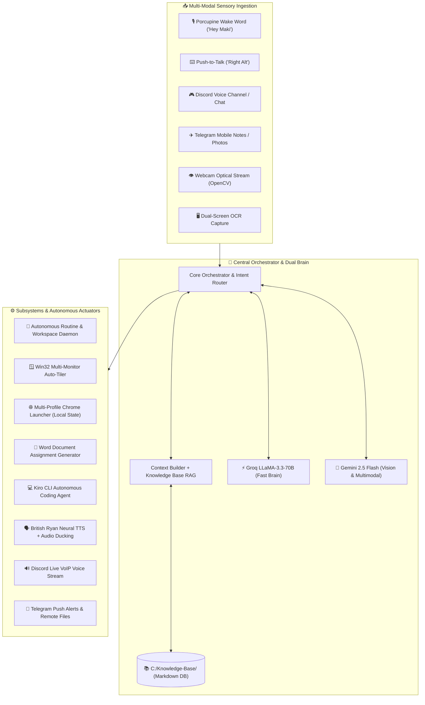

<div align="center">

# 🤖 MAKI·AI (巻)
### *Next-Generation Autonomous Desktop Companion & Windows OS Orchestrator*

<p align="center">
  <a href="https://git.io/typing-svg">
    
  </a>
</p>

<p align="center">
  
  
  
  
  
  
  
</p>

---

</div>

## 🌌 System Architecture & Data Flow



---

## ⚡ Key Capabilities Showcase

<table>
  <tr>
    <td width="50%" valign="top">
      <h3>🚀 Autonomous Routine Engine</h3>
      <ul>
        <li><b>Lead-Time Provisioning:</b> Monitors schedule and provisions workspaces 15m before events.</li>
        <li><b>College Classes:</b> Launches Google Meet, Google Classroom, Facebook & VS Code for <code>BAT-600</code> & <code>ICC-600</code>.</li>
        <li><b>Client Workflows:</b> Boots dedicated client Chrome profile with Metricool, Instagram, Facebook, YouTube, & Astra AI.</li>
        <li><b>Smart Reasoning:</b> Off-schedule polite contextual reasoning when triggered manually.</li>
      </ul>
    </td>
    <td width="50%" valign="top">
      <h3>🎯 Dual-Niche Job Hunting</h3>
      <ul>
        <li><b>AI Video Creator:</b> Multi-Profile Chrome Launch (OnlineJobs, LinkedIn, ChatGPT, Gemini, Portfolio) + Resume folder.</li>
        <li><b>Social Media Manager:</b> Multi-Profile Chrome Launch (OnlineJobs, LinkedIn, Indeed, Canva) + Resume folder.</li>
        <li><b>Interactive GUI Modal:</b> Rapid niche selection pills.</li>
      </ul>
    </td>
  </tr>
  <tr>
    <td width="50%" valign="top">
      <h3>🎮 Discord Remote Voice Bridge</h3>
      <ul>
        <li><b>Live Voice Channel Calling:</b> Joins Discord voice (<code>!call</code>) and speaks with British Ryan Neural voice.</li>
        <li><b>Full-Duplex AI Interaction:</b> Ask schedule questions, trigger routines, or request document generation directly via Discord.</li>
        <li><b>Remote Screenshot:</b> <code>!screen</code> captures dual displays and uploads directly to chat.</li>
      </ul>
    </td>
    <td width="50%" valign="top">
      <h3>✈️ Telegram Mobile Remote</h3>
      <ul>
        <li><b>24/7 Mobile Control:</b> <code>@makiai_assistant_bot</code> for on-the-go access.</li>
        <li><b>Voice Memo Transcriptions:</b> Groq Whisper speech transcription for audio notes.</li>
        <li><b>Rubric to Word Ingestion:</b> Drop rubric photos in chat to auto-generate formatted <code>.docx</code> assignments.</li>
        <li><b>Storage Remote:</b> Search & download files from <code>C:\MakiSync Storage</code>.</li>
      </ul>
    </td>
  </tr>
  <tr>
    <td width="50%" valign="top">
      <h3>👁️ Multimodal Dual-Vision</h3>
      <ul>
        <li><b>Webcam Observer:</b> Identifies held objects, monitors posture, and tracks physical activities.</li>
        <li><b>Screen OCR Debugging:</b> Inspects terminal stack traces, UI errors, or code snippets with Gemini Vision.</li>
      </ul>
    </td>
    <td width="50%" valign="top">
      <h3>🪟 Win32 Window Auto-Tiling</h3>
      <ul>
        <li><b>Zero-Gap Tiling:</b> Organizes desktop apps into clean side-by-side, 3-column, or 2x2 grids.</li>
        <li><b>Cross-Monitor Relocation:</b> Moves apps smoothly between primary and secondary displays.</li>
      </ul>
    </td>
  </tr>
</table>

---

## 📂 Project Structure

```text
MakiAI/
├── main.py                     # Main application entry point & lifecycle manager
├── config/                     # Configuration definitions
│   └── routines.json           # Scheduled classes, client blocks & job-hunting presets
├── core/                       # Central system orchestration
│   ├── orchestrator.py         # Intent dispatching, skill execution & LLM fallbacks
│   └── state_manager.py        # System state tracking (idle, listening, thinking, speaking)
├── gui/                        # Desktop & Web user interface
│   ├── ui_bridge.py            # Python-to-WebUI interactive modal bridge
│   ├── web_ui/                 # HTML5/JS Glassmorphic Dashboard & Modal Forms
│   └── styles/                 # Dark glassmorphism QSS styling
├── services/                   # Modular subsystem services
│   ├── ai/                     # Groq & Gemini API clients, Context Builder
│   ├── browser/                # Chrome profile management & web automation
│   ├── camera/                 # Webcam capture & screenshot handlers
│   ├── cloud/                  # Composio & third-party integrations
│   ├── computer/               # Window manager, auto-tiler, system health & app launcher
│   ├── kb/                     # Knowledge Base indexer, reader, writer & router
│   ├── media/                  # Spotify & native Windows media controls
│   ├── memory/                 # Multi-session memory persistence
│   ├── reminder/               # Background task scheduler & notifications
│   ├── remote/                 # Telegram & Discord 24/7 Mobile/Desktop Voice & Remote Bridges
│   │   ├── discord_service.py  # Discord.py voice channel calling & live audio stream
│   │   └── telegram_service.py # Telegram bot, voice notes & document ingestion
│   ├── routines/               # Autonomous routine monitoring daemon & workspace launcher
│   ├── storage/                # MakiSync storage path handlers & utilities
│   └── voice/                  # Porcupine wake word, STT, Edge-TTS & audio ducking
├── skills/                     # High-level domain capabilities
│   ├── routine_skill.py        # On-demand workspace preparation & modal triggers
│   ├── goodmorning_skill.py    # Morning routine & daily schedule briefing
│   ├── goodnight_skill.py      # Evening wrap-up & tomorrow preview
│   ├── deadline_skill.py       # Deadlines tracking & milestone logging
│   ├── homework_skill.py       # School document & assignment authoring
│   ├── new_project_skill.py    # 11-stage project planning lifecycle
│   ├── research_skill.py       # Live internet search & synthesis
│   ├── memory_skill.py         # Personal preference storage & retrieval
│   └── interpreter_skill.py    # Local code execution & math engine
└── data/                       # Local JSON databases (memory, reminders, config)
```

---

## 🚀 Getting Started

<details>
<summary><b>🛠️ Step-by-Step Installation & Setup (Click to Expand)</b></summary>

### 1. Prerequisites
- **Operating System**: Windows 10 or Windows 11 (64-bit)
- **Python**: Version `3.11` or higher
- **FFmpeg**: Installed and accessible in Windows `PATH` (for Discord voice streaming)
- **Microphone & Webcam**: For wake word, voice, and optical vision

### 2. Clone the Repository
```bash
git clone https://github.com/makinity/MakiAI.git
cd MakiAI
```

### 3. Virtual Environment Setup
```bash
python -m venv venv
venv\Scripts\activate
```

### 4. Install Dependencies
```bash
pip install -r requirements.txt
pip install "discord.py[voice]"
```

### 5. Configure Environment Variables (`.env`)
```ini
# Primary AI Engine (Groq - Fast inference)
GROQ_API_KEY=gsk_...

# Vision & Fallback AI (Google Gemini)
GEMINI_API_KEY=AIzaSy...

# Wake Word (Picovoice)
PORCUPINE_ACCESS_KEY=...
WAKE_WORD=Hey Maki

# Local Knowledge Base & Storage Paths
KB_PATH=C:\Knowledge-Base
MAKI_SYNC_PATH=C:\MakiSync Storage

# Voice / TTS Settings
TTS_VOICE=en-GB-RyanNeural
TTS_PITCH=-8Hz
TTS_RATE=+2%

# Remote Bridges
TELEGRAM_BOT_TOKEN=...
TELEGRAM_ALLOWED_USER_ID=...
DISCORD_BOT_TOKEN=...
DISCORD_GUILD_ID=...
DISCORD_VOICE_CHANNEL_ID=...
DISCORD_TEXT_CHANNEL_ID=...
```

### 6. Run MakiAI
```bash
python main.py
```
</details>

---

## 🗣️ Voice Commands & Remote Triggers Reference

<details>
<summary><b>🎙️ Full Voice & Remote Commands Table (Click to Expand)</b></summary>

| Category | Example Command / Prompt | Expected Action |
|---|---|---|
| **🎯 Job Hunting (Interactive)** | *"Maki, let's hunt a job"* | Prompts for niche selection and displays GUI modal |
| **📹 Job Hunting (AI Video)** | *"Hunt for AI video creator jobs"* | Opens dual Chrome profiles (OnlineJobs, LinkedIn, ChatGPT, Gemini, Portfolio) + AI Video Resume folder |
| **📱 Job Hunting (SMM)** | *"Let's hunt for SMM jobs"* | Opens dual Chrome profiles (OnlineJobs, LinkedIn, Indeed, Canva) + SMM Resume folder |
| **🎓 Online Class Prep** | *"Prep for class"* / *"Prep for online class"* | Detects schedule and opens Google Meet, Google Classroom, Facebook & VS Code |
| **💼 Client Work Prep** | *"Prep for client work"* / *"Prep for work"* | Opens client Chrome profile with Metricool and social platforms |
| **🎮 Discord Voice Calling** | `!call` / `!join` / `!say [text]` | MakiAI enters Discord voice channel and streams speech |
| **✈️ Telegram Remote** | `/screenshot`, `/camera`, `/browse` | Snaps PC screens/webcam or downloads files to mobile |
| **📅 Schedule & Agenda** | *"Good morning Maki"* / *"Ano schedule ko today?"* | Reads today's time-table from `time-management.md` |
| **🌅 Tomorrow Preview** | *"What is my schedule tomorrow?"* / *"Ano schedule ko bukas?"* | Previews upcoming activities for the next calendar day |
| **💻 Autonomous Coding** | *"Open Kiro for TaskMaster"* | Spawns Kiro CLI in target project directory |
| **📝 Academic & Homework** | *"Create my homework based on rubric in Temp-Guide"* | Generates styled `.docx` in Assignments folder |
| **👁️ Vision (Webcam)** | *"What am I holding in my hand?"* | Inspects webcam feed and describes the object |
| **🖥️ Vision (Screen)** | *"Look at my screen and explain this error"* | Performs screen capture and OCR debugging |
| **🪟 Window Layout** | *"Organize my workspace"* / *"Tile my windows"* | Snaps apps into multi-monitor grid/split layouts |
| **📊 Hardware Vitals** | *"What are my system vitals?"* / *"How is my battery?"* | Reports CPU, RAM %, and battery charge status |

</details>

---

<div align="center">
  <sub>Built with ❤️ by <b>Mark Vencent Juntilla</b> · Personal & Proprietary Development</sub>
</div>
