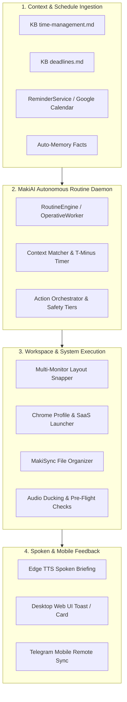

# MakiAI — Proactive Intelligence & Autonomous Workspace Engine
## Strategic Improvement Roadmap & Architecture Blueprint

This document outlines the high-impact architectural enhancements and proactive capabilities designed for **MakiAI**. The goal is to evolve MakiAI from a **reactive assistant** *(user speaks → assistant executes)* into a **proactive, context-aware digital companion** *(anticipates schedule, provisions workspaces, safeguards deadlines, and syncs across devices)*.

---

## 🏛️ System Architecture Overview



---

## 🚀 Key Feature Blueprints

### 1. 🎓 Context-Aware Workspace & Routine Auto-Prep Engine
* **Goal:** 15 to 30 minutes before a scheduled event, MakiAI auto-prepares the exact digital environment, browser profiles, links, documents, and hardware settings.

#### A. Online Class / Study Mode (T-15 Minutes)
* **Trigger:** Scheduled class in `workflows/time-management.md` (e.g. *Capscun 2*, *ICC 600*) or voice command (*"Prep for class"*).
* **Automated Actions:**
  1. **Meeting Launch:** Opens the recurring Google Meet link for the subject.
  2. **Academic Tabs:** Opens Google Classroom and a Gemini research tab.
  3. **Course Materials:** Opens the subject folder in `C:\MakiSync Storage\Notes\School\` and the active lecture document/PDF.
  4. **Audio Optimization:** Pauses background entertainment; sets voice volume to 65%.
  5. **Spoken Briefing:**
     > *"Sir, your Capstone 2 class begins in 15 minutes. I have prepared your Google Meet, Classroom, and research tabs."*

#### B. Client Work / Agency Mode (T-15 Minutes)
* **Trigger:** Work blocks, client deadlines, or voice command (*"Prep for client work"*).
* **Automated Actions:**
  1. **Dedicated Profile:** Launches dedicated Client Chrome Profile (separating client logins from personal accounts).
  2. **Marketing SaaS Suite:** Opens Canva, Metricool, Meta Business Suite (Facebook/Instagram), YouTube Studio, and ChatGPT.
  3. **Asset Directory:** Opens `C:\MakiSync Storage\Clients\` or specific project folder.
  4. **Spoken Briefing:**
     > *"Switching to Client Work mode. Your marketing tools, client profile, and asset storage are ready, sir."*

#### C. Interview & Meeting Mode (T-30 Minutes)
* **Trigger:** Scheduled interview/meeting in `ReminderService` (e.g. *Essence Marketing & Design interview*).
* **Automated Actions:**
  1. **Meeting Link:** Launches Zoom app or Google Meet room.
  2. **Candidate Prep:** Opens updated Resume / CV PDF and Company Research notes.
  3. **Pre-Flight Hardware Check:** Verifies microphone input, volume level, and camera status.
  4. **Do Not Disturb:** Silences non-critical system notifications.
  5. **Spoken Briefing:**
     > *"Sir, your interview with Essence Marketing is in 30 minutes. Your meeting link, resume, and audio checks are all prepped."*

#### D. Declarative Routine Configuration (`config/routines.json`)
```json
{
  "routines": {
    "online_class_capstone": {
      "name": "Capstone 2 Lecture",
      "lead_time_minutes": 15,
      "links": [
        "https://meet.google.com/your-class-code",
        "https://classroom.google.com",
        "https://gemini.google.com"
      ],
      "apps": ["code"],
      "storage_folder": "Notes/School",
      "voice_announcement": "Sir, your Capstone 2 class begins in 15 minutes. I have prepared your Google Meet and research tabs."
    },
    "client_marketing_work": {
      "name": "Essence Marketing & Social Media",
      "lead_time_minutes": 15,
      "chrome_profile": "Profile 1",
      "links": [
        "https://www.canva.com",
        "https://app.metricool.com",
        "https://business.facebook.com",
        "https://chatgpt.com"
      ],
      "storage_folder": "Clients",
      "voice_announcement": "Client marketing workspace loaded, sir."
    }
  }
}
```

---

### 2. 🖥️ Multi-Monitor "Stage Layout" Topology Switcher
* **Goal:** Instant dual-monitor window snapping tailored for your **24" NVISION (Primary)** and **27" 165Hz LG UltraGear (Secondary)** monitors.

| Mode | Primary Monitor (24" NVISION) | Secondary Monitor (27" 165Hz LG UltraGear) |
| :--- | :--- | :--- |
| **`"Maki, coding layout"`** | VS Code (Maximized) | Chrome DevTools (Left 50%) + Docs / ChatGPT (Right 50%) |
| **`"Maki, class layout"`** | Lecture Notes / Word / IDE | Google Meet (Fullscreen) + Gemini Research Tab |
| **`"Maki, stream layout"`** | Game (Fullscreen) | Discord + OBS Studio + Twitch/YouTube Chat |
| **`"Maki, client layout"`** | Canva Graphic Editor | Metricool Scheduler + Meta Business Suite |

---

### 3. 📂 Post-Class & Post-Meeting Auto-Archiver
* **Goal:** Clean up the desktop and archive materials automatically once a session concludes.
* **Mechanism:**
  1. Detects meeting closure (Google Meet / Zoom window closed or scheduled end-time reached).
  2. Scans `Downloads` for newly downloaded PDFs, slides, or assignment briefs.
  3. Moves them into the designated `C:\MakiSync Storage\Notes\School\[Subject]\` folder.
  4. Appends a brief status line to `workflows/carryover.md`.
  5. Spoken confirmation: *"Class session closed, sir. I've archived today's lecture files into your Capstone folder."*

---

### 4. 📡 VIP Client & Interview "Radar" Watchdog
* **Goal:** Priority notifications for high-stakes emails without checking your inbox manually.
* **Mechanism:**
  1. Lightweight background operative (via Composio / Gmail integration).
  2. Tracks VIP contacts (e.g. *Essence Marketing*, professors, key clients).
  3. Triggers on priority keywords: `["reschedule", "urgent", "contract", "interview", "offer", "deadline"]`.
  4. Automatically ducks audio and speaks:
     > *"Sir, an urgent email from Essence Marketing regarding your interview schedule has just arrived."*
  5. Renders a 1-click interactive preview card on the desktop Web UI.

---

### 5. 🛡️ School Submission & Deliverable Integrity Shield
* **Goal:** Prevent accidental missed assignments, corrupted files, or naming format mistakes before deadlines.
* **Mechanism:**
  1. **T-60 Minutes Before Deadline:** Maki checks `C:\MakiSync Storage\` to ensure the required deliverable exists and is not 0 bytes.
  2. **Auto-Submission Workflow:**
     - Converts `.docx` to clean `.pdf`.
     - Standardizes filename format: `[LASTNAME]_[FIRSTNAME]_[SUBJECT]_[ASSIGNMENT].pdf`.
     - Directs browser to the exact Google Classroom assignment turn-in page.

---

### 6. 📱 Nightly Telegram Sync & 2-Way Mobile Carryover
* **Goal:** Seamless continuity between your desktop PC and mobile phone.
* **Mechanism:**
  - **Evening Briefing (10:30 PM / *"Good night Maki"*):**
    - Maki compiles tomorrow's classes, deadlines, reminders, and client tasks.
    - Sends a clean, formatted Telegram agenda directly to your phone.
  - **On-the-Go Task Capture:**
    - Sending a Telegram message (*"Add deadline: Capstone survey on Friday"*) immediately indexes the task into the desktop Knowledge Base.

---

## 📊 Implementation Matrix

| Feature | Target Component | Complexity | Priority |
| :--- | :--- | :---: | :---: |
| **Workspace Auto-Prep Engine** | `services/routines/routine_engine.py` + `config/routines.json` | Medium | **P1** |
| **Multi-Monitor Stage Layouts** | `services/computer/window_manager.py` | Low | **P2** |
| **VIP Email & Message Radar** | `services/cloud/composio_service.py` + `email_watcher.py` | Medium | **P3** |
| **Deliverable Integrity Shield** | `skills/deadline_skill.py` + `services/computer/file_manager.py` | Low | **P4** |
| **Nightly Telegram Carryover** | `services/remote/telegram_service.py` | Low | **P5** |
| **Post-Session Auto-Archiver** | `services/storage/maki_sync.py` | Low | **P6** |
